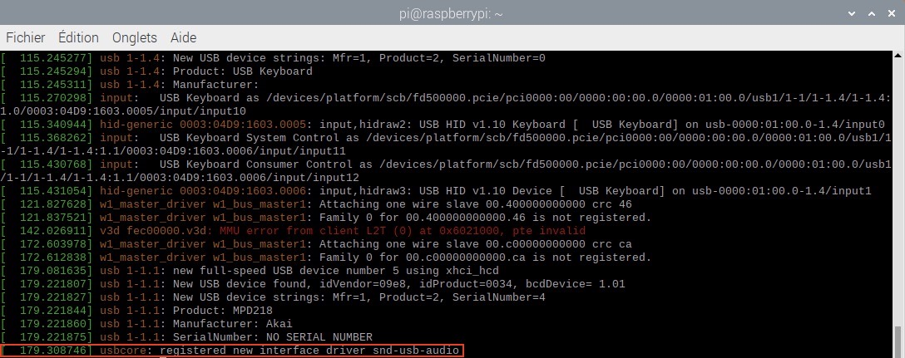
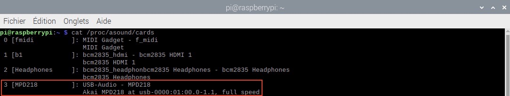
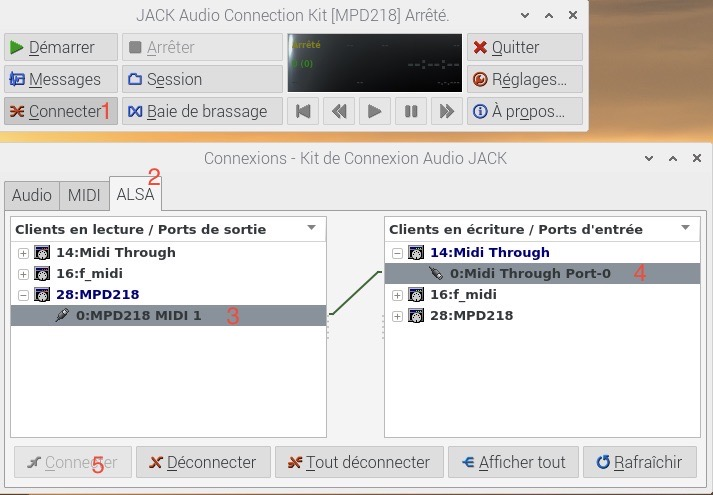

# PTS - Sampler

## Organisation de l'environnement de développement

1. **Documentations** : Contient du les documents de conception, cahier des charges ou tout autre information documentant le produit.
2. **Configuration-Akai_MPD218** : Configuration du clavier réalisée depuis le logiciel d'édition `MPD218 editor`
3. **requirements.txt** : Fichier contenant les dépendances à installer. La commande est : `pip -r requirements.txt`
4. **src** : Contient le code source du projet : les modules et les différents sons.
5. **Ressources :** COntient les images introduites dans ce README
6. **conf :** Les fichiers de configuration concernant le raspberry se trouvent dans ce dossier (sh...).

# Préparation de l'environnement

Afin d'installer convenablement l'environnement MIDI afin d'utiliser ce protocole, des prérequis sont à prendre en compte selon le système d'exploitation utilisé. Voici la procédure complète.

## Linux

### Installation manuelle

1. Installer le paquet **build-essential** (paquet est nécessaire pour construire des paquets Debian). Utiliser la commande suivante : `sudo apt-get install build-essential` (<a href="https://packages.debian.org/fr/sid/build-essential">buid-essential</a>)

2. Si l'environnement de développement python n'est pas déjà installé, y remédier à l'aide de la commande : `sudo apt-get install python-dev`

3. Pour pouvoir béneficier des fonctionnalités MIDI, nous avons besoin d'utiliser le support ALSA (Advanced Linux Sound Architecture). Deux librairies sont requises : **libasound2** et **libjack**. Les installer avec ces deux commandes respectives : `sudo apt-get install libasound2-dev` et `sudo apt-get install libjack-jackd2-dev` (<a href="https://packages.debian.org/fr/sid/libasound2">libasound2</a> & <a href="https://packages.debian.org/fr/sid/jackd2">libjack (jackd2)</a>)

### Installation automatisée

**Se déplacer à la racine du projet :**

1. Exécuter la commande :  chmod +x install.sh (ajout des droits d'exécution du scipt)

2. Lancer l'installation automatique des différents paquets à l'aide de la commande `./install.sh`

3. Ensuite dans un deuxième terminal lancer le logiciel QJackCtl : `qjackctl` et réaliser les étapes décrites plus bas.

4. Dans le premier terminal, se déplacer dans le répertoire src `cd src` et lancer le programme : `python Main.py`. 

## macOS

1. Intaller la dernière version de **Xcode**. Ce dernier met à disposition le framework **coreMIDI** pour la communication entre périphériques possédant ce protocole.

# Récupération du projet

Pour récupérer le projet, ouvrir un terminal et exécuter la commande `git clone https://forge.iut-larochelle.fr/ljeudy/2020-2021-INFO2-PTS3-Sampler.git`

# Installation des dépendances 

Etape commune aux différents systèmes d'exploitation.

Pour ce projet deux dépendances sont obligatoires : <a href="https://pypi.org/project/rtmidi-python/">rtmidi-python</a> - <a href="https://spotlightkid.github.io/python-rtmidi/rtmidi.html">documentation</a> - (relative au protocole MIDI et la communication) et  <a href="https://pypi.org/project/pygame/">pygame</a> - <a href="https://www.pygame.org/docs/">documentation</a> - (librairie musicale pour la lecture de sons...)

En se placant à la racine du projet, exécuter la commande `pip install -r requirements.txt` 

# Problèmes pouvant être rencontrés

## Linux 

Si toutefois, aucun message MIDI n'est détecté par l'ordinateur, verifier que le clavier est bien reconnu et est bien connecté en tant que port MIDI. Voici les étapes pour réaliser cela.

1. Pour savoir si le clavier est reconnu par le noyau, exécuter la commande : `dmesg`. A l'issue de celle-ci, la ligne suivante oit s'afficher.

2. Autre façon de sen assurer avec la commande `cat /proc/asound/cards`. La reconnaisaance du périphérique se traduit par l'affichage suivant : 

3. Ensuite, si ce n'est pas déjà fait, installer le logiciel QJackCtl avec la commande : `sudo apt-get install qjackctl`.

4. L'ouvrir avec la commande `qjackctl`.

5. Cliquer sur l'onglet `Connecter`, puis `ALSA`

6. Selectionner le **périphérique MIDI (Ici, MPD218) à gauche** et le **port Midi Through (Ici, 14)** et cliquer sur `Connecter`.

# Exécution du projet

1. Dans un terminal, se déplacer à la racine du projet. 

2. Executer la commande `python src/Main.py`
